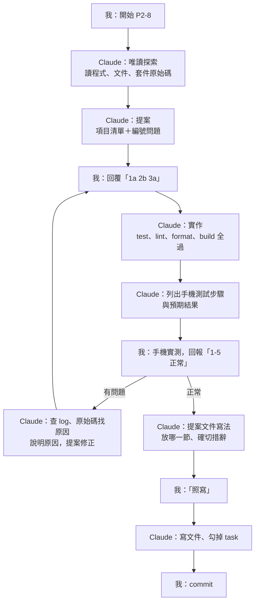

# 換了沒：技術選擇與 Claude Code 工作流程

> 簡報稿，2026-09-15。每一節是一頁，`---` 分頁；「講者備註」是口頭補充，不用放上投影片。
> 講到產品時切到網頁版 demo（`http://127.0.0.1:8090`）；P3 的通知規劃可以開 [p3 原型](prototype/p3.html)。
> 第 5 頁的流程圖用 mermaid 語法，GitHub 會畫出來，其他 Markdown 檢視器不一定支援。

---

## 1. 專案：換了沒

**家庭耗材更換提醒器**：冷氣濾網、淨水器濾心、防潮盒……記錄上次什麼時候換、多久該換，到期前提醒。

- 核心循環：**到期推算 → 提醒 → 換好了 → 重新推算**
- 已完成（P1、P2）：依位置分組的首頁與篩選、換好了、暫停、照片、價格、實際間隔回饋、匯出與還原
- 幾個刻意的設計：週期不自動學「實際間隔」（避免拖延被學成新標準）、暫停必須填恢復日（避免永遠不提醒）、金額記在採購紀錄（一捲濾網換五台冷氣）
- 進度：2026-09-09 ～ 09-15，40 個 commit、43 項 task、246 個單元測試
- 下一階段：P3 包成 Android app、本地通知；P4 拍包裝辨識型號、成本統計

> 講者備註：這頁快速帶過，切到 demo 操作一輪「新增物品 → 換好了」。

---

## 2. 技術選擇的原則

**階段性架構**

- P1、P2：網頁版。React 前端 ＋ PocketBase（內嵌 SQLite），Docker 跑在家裡的機器，手機用區網連
- P3：Capacitor 包成 Android app，資料換成手機上的 SQLite，提醒改用本地通知，**後端消失**

**原則**

1. **後端終將消失**：網頁版的後端只是過渡，所以「寫最少的鷹架」比「後端寫得漂亮」重要
2. **暫定的選擇要有退場保險**：所有資料存取集中在 `src/repo/`，UI 不直接碰後端。之後換掉資料層，UI 一行不改
3. **查證再選**：版本相容性、維護狀態、授權，查過並寫下查證日期；舊結論被推翻就更新文件
4. **每個依賴都要理由**：Claude 提出理由與版本，我確認後自己安裝；0.x 的套件集中在單一檔案使用，換套件只改那裡

---

## 3. 為什麼選 PocketBase

**選它的理由**

- 一個執行檔就是後端：資料庫（SQLite）、REST API、檔案上傳、**照片縮圖**、管理後台、排程備份都內建
- 後端程式碼接近零：不用寫 API、上傳、縮圖，schema 用 migration 定義
- 符合原則 1：P3 後端就消失，不值得現在花時間建一個自己的後端

**評估過的其他做法**

| 做法 | 結論 |
|---|---|
| 自建 Hono ＋ Prisma ＋ SQLite | 寫得漂亮但鷹架多；列為 PocketBase 的**退場方案**（重寫 `src/repo/`、建後端、搬資料） |
| P1 就直接做 app，跳過後端 | 省掉 PocketBase、Docker 與 P3 的資料搬遷，但 P1 就要架 Android 建置環境、沒有後台與縮圖。想最快開始用，所以沒選（2026-09-11 評估） |
| P3 把 PocketBase 包進 app | 官方不支援，唯一的社群專案停在 v0.24.4，還要自己寫原生包裝。為了省重寫換一個自己維護的舊依賴，不划算（2026-09-11 查證） |

**代價與保險**

- pre-1.0，官方說不建議用在關鍵的正式環境，v0.23 曾有大改版 → **版本 pin 死**（Dockerfile 固定版本＋checksum）、**migration 進 git**
- 沒有 ORM 產生的型別，而且欄位存不了空值（沒填存 0 或空字串）→ **資料進出 `src/repo/` 都用 zod 驗證**，在邊界轉成 `null`
- 預設值要改：新 collection 的 API 權限預設只有管理員能用、batch API 預設關閉 → 都寫成 migration

**退場條件與檢核**：事先寫好四個條件（權限擋路、型別問題反覆、破壞性升級、查詢做不到被迫寫伺服器程式），P1、P2 結束各檢核一次

- 結果：**四項都沒觸發**，續用到 P3
- 兌現：檔案上傳、縮圖、排程備份
- 落空：備份 API 要管理員登入，前端用不了 → 改成 app 自己的備份格式（P3 也能沿用）
- 實際走過一次升級（v0.40.3 → v0.40.4），只改版本與 checksum
- 踩到的坑（都寫進 `CLAUDE.md`）：更新紀錄時帶上照片欄位會刪掉沒列到的檔案；同一次交易刪掉再重建同一筆紀錄，照片會被背景清掉

> 講者備註：PocketBase 的行為（空值、權限、batch、刪檔時機）都是讀它的 Go 原始碼確認的，不是看網路文章猜的。

---

## 4. 其他技術選擇

| 領域 | 選了 | 沒選 | 理由 |
|---|---|---|---|
| 前端框架 | Vite ＋ React（純靜態） | Next.js | 用不到 SSR、SEO；Capacitor 只吃靜態檔，Next.js 得關掉一半功能 |
| App 化 | Capacitor | React Native、Flutter | 表單＋清單＋相機＋本地通知都在 Capacitor 的舒適區；RN 要重寫 UI，Flutter 連資料層都要用 Dart 重寫 |
| 資料庫 | SQLite | Postgres | 單人使用沒有併發問題；備份就是複製一個資料夾；結構直接是 app 版要用的 |
| 提醒 | 本地通知（P3） | Telegram、Web Push | 不需要 HTTPS、伺服器、憑證；Web Push 要在家裡的機器掛憑證，為過渡期不值得 |
| Lint | oxlint（type-aware） | ESLint ＋ typescript-eslint | 專案用 TypeScript 7，typescript-eslint 只支援 6.1 以前；oxlint 的型別檢查反而要求 TS 7。代價是 beta |
| 測試 | Vitest | — | 跟 Vite 同一套工具鏈，不用額外設定 |
| 樣式 | Tailwind CSS 4 | — | 手機優先的版面寫起來順；原型用 v3 CDN，搬進正式版只要改少數 class |
| 拖曳排序 | `@dnd-kit/react` | `@dnd-kit/core` | 舊版 2024-12 後沒有新版；新版支援 React 19。代價是 0.x，拖曳程式集中在一個檔案 |
| 備份格式 | 自己的 zip（JSON ＋照片） | PocketBase 備份 API | API 要管理員登入；PocketBase 的備份是它的資料庫檔，P3 讀不了 |
| 日期欄位 | 文字＋格式檢查 | PocketBase 的 date | date 欄位在後台改日期會用瀏覽器時區，悄悄差一天，不會報錯 |
| 照片格式 | JPEG（上傳前壓到長邊 1600） | WebP | PocketBase 的縮圖只完整支援 jpg、png、gif |
| 字型 | 字型檔放進 repo | Google Fonts CDN | app 離線時載不到 CDN |
| 「今天」 | 依手機時區 | 寫死台北時區 | 之後想讓其他國家的人用；代價是出國時「今天」變成當地日期 |

> 講者備註：「沒選」欄只列真的評估過的選項。每一列在 `CLAUDE.md` 的決策紀錄都有對應的理由，部分附查證日期。

---

## 5. Claude Code：一個 task 的生命週期

- 唯讀的探索不用問；**改檔案、改設定、commit 之前一定先提案**
- 提案和執行分成不同回合，避免「提完案就順手做了」
- 選項附推薦與理由，我可以只回代號，也可以追問

---

## 6. 文件就是記憶

**為什麼**：session 會結束，長對話會被壓縮成摘要，細節會遺失。**沒寫進文件的決定，下一個 session 就不存在**，甚至會被重新推翻。

| 文件 | 放什麼 |
|---|---|
| 全域 `~/.claude/CLAUDE.md` | 怎麼跟我合作：提案規則、破壞性操作要先說明、查證與標明未驗證的標準。所有專案共用 |
| 專案 `CLAUDE.md` | 紀律（repo 層、純靜態前端、PocketBase 配套）、已知的坑、決策紀錄、指令。每條附「為什麼」 |
| `docs/PRODUCT.md` | 規格：原型呈現不出來的規則與理由 |
| `docs/prototype/` | 確認過的畫面（P0、P3） |
| `docs/TASKS.md` | 一次做一項；每項有完成定義，另有檢核點（P1-21、P2-14 檢核 PocketBase） |

**維護規則**

- 推導出決定、發現文件有誤，**當下就提案寫入**，包含放哪一節、確切措辭
- 提案是 Claude 的義務，寫不寫由我決定
- 推翻文件裡的斷言時，**修正要跟更正一起提出**。實例：原本寫「日期不要用 date 欄位」，實測後其實是取捨，當時只在對話更正、沒改文件，直到我問「有記錄嗎」才補

---

## 7. 協作規則、分工與環境限制

**分工**

| Claude | 我 |
|---|---|
| 寫程式、寫文件、跑測試與檢查 | 做決定、確認提案 |
| 讀 log、讀原始碼、查 npm 版本 | 安裝套件（Claude 給套件名與版本） |
| 列手機測試步驟與預期 | 跑 docker、手機實測回報 |
| 提案文件寫法 | commit（明確指定檔案） |

**環境限制，以及因此形成的做法**

- **沙箱**：Claude 的指令在沙箱裡跑，不能執行 docker、連不到本機的 PocketBase → docker 由我跑，把輸出貼回來
- **權限**：Claude 不能寫全域設定檔（例如 `~/.claude/CLAUDE.md`）→ 先寫到暫存資料夾，我再替換
- **git**：沙箱會在專案根目錄掛出空的設定檔，`git add -A` 曾誤收進 22 個空檔 → 一律明確指定檔案
- **context 壓縮**：長對話被摘要後細節可能失真 → 以文件為準，不確定就回頭讀檔
- **sub agent**：不使用自訂 agent 定義，sub agent 的回報一律當作未驗證

---

## 8. 查證、原型關卡與驗證

**查證，不靠猜**

- 讀 PocketBase 原始碼：欄位空值、API 權限的預設、batch 預設關閉、刪除紀錄時怎麼清檔案
- 查 npm registry：版本、相依、維護狀態（例如 Capacitor 8.5.2 需要 Node 22 以上、JDK 21）
- 實測：後台改 date 欄位會差一天、999 筆更換紀錄的復原
- **沒驗證的判斷要標明**，不能跟查證過的事實混在一起講

**原型關卡**

- 每個階段開工前，畫面先做成 HTML 原型（Claude 的 artifact），確認後才寫程式
- 原型改一次便宜，寫進程式後再改貴好幾倍；原型驗證不了的（相機、通知樣式、拖曳手感）留到手機實測

**驗證**

- 交付前 `pnpm test`、`lint`、`format:check`、`build` 全過
- 手機實測抓到的問題，單元測試抓不到：網頁版開相機照片會遺失、底部面板開著時提示條按不到

---

## 9. Claude 判斷錯的時候

AI 會講錯，工作流程要能**發現、更正、防止再犯**。

| 案例 | 怎麼發現 | 怎麼處理 |
|---|---|---|
| 規格寫「區網內可以用網頁開相機拍照」 | 手機實測照片遺失（瀏覽器被系統回收） | 更正規格，P2 改成只能從相簿選，拍照留到 P3 |
| 估「一個物品很多年才會到 49 筆更換紀錄」（刪除後復原的上限） | 討論上限時重新估算，發現沒考慮 7 天週期 | 上限調到 1000，實測 999 筆 |
| 資料庫事件中，把舊的指令輸出當成現況在推原因 | 事後對照輸出的時間 | 更正推論；全域規則加上「先確認輸出的來源和時間，再推原因」 |
| 還原備份的設計，照片被 PocketBase 在背景清掉 | 升級 PocketBase 後發現照片不見，查出是更早一次還原造成 | 查請求紀錄與原始碼找到原因、修正、四種情況實測，並把這個坑寫進 `CLAUDE.md` |

**對策都寫成規則**：沒驗證的要標明、判斷錯要明講、估算先列假設、推翻文件裡的斷言時要一起提出修正

**下一步**：P3，Android app 與本地通知（原型已確認）
